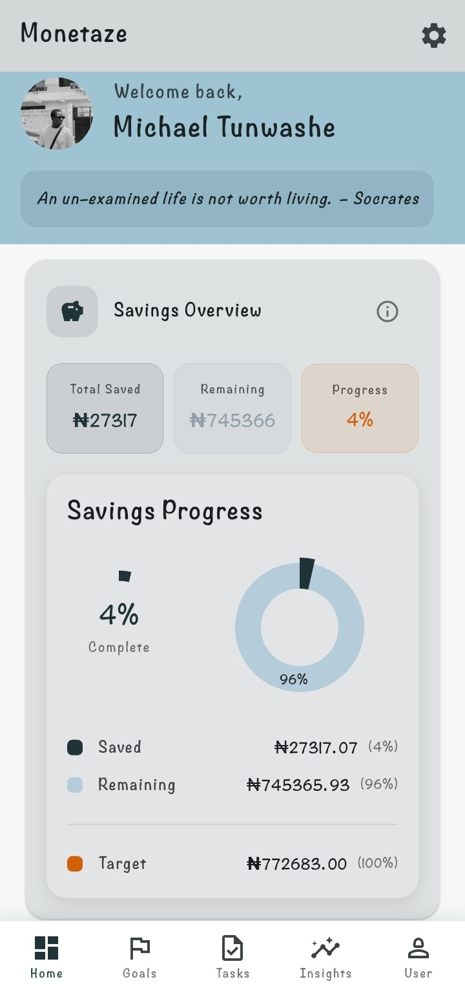
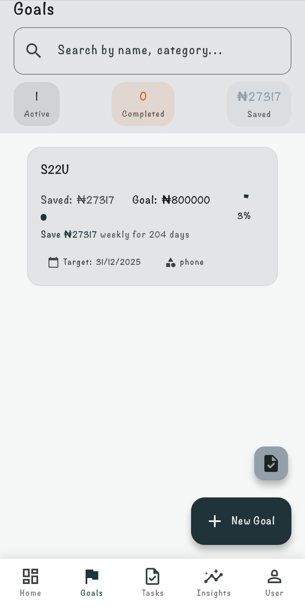
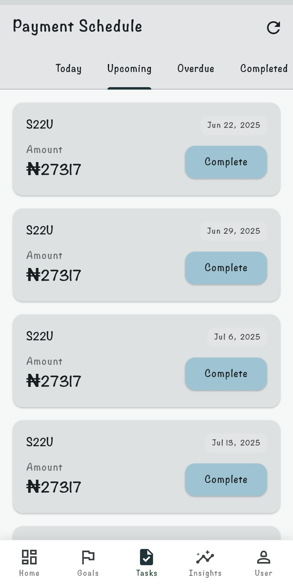
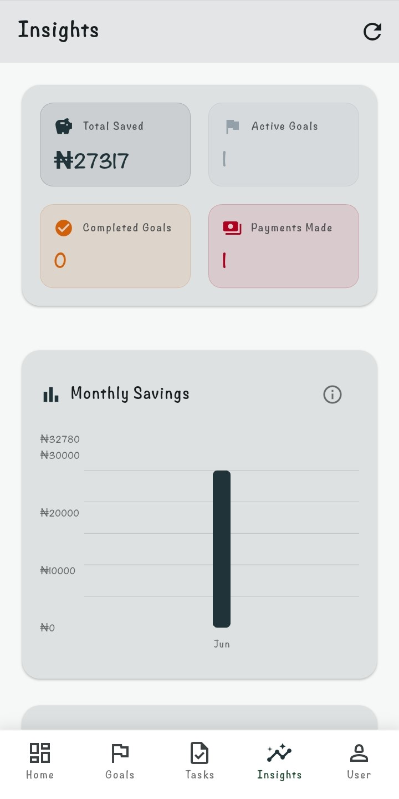
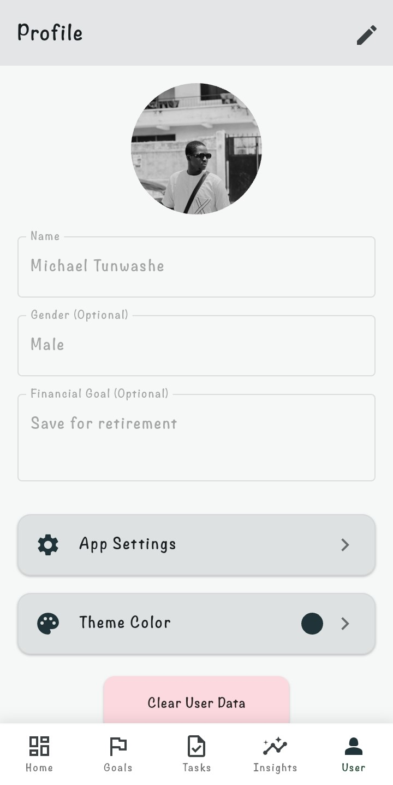

# 💰 Monetaze - Your Personal Finance Companion

Monetaze is a modern and intuitive personal finance management application designed to help you track your expenses, set financial goals, and manage your savings effectively. With an intuitive interface and powerful features, Monetaze aims to make financial management simple and accessible for everyone.

## ✨ Features

  * **Goal Setting & Tracking:** Define your financial goals (e.g., saving for a car, down payment, vacation) and track your progress in real-time.
  * **Task Management:** Break down your financial goals into manageable tasks, helping you stay on track with your savings plan.
  * **Insights & Analytics:** Gain valuable insights into your spending habits and savings trends through visual reports and summaries.
  * **Personalized Themes:** Customize the app's appearance with various color themes to suit your preferences.
  * **Notifications:** Receive timely reminders for upcoming tasks and goal milestones.
  * **User Profiles:** Create and manage your personal financial profile.

## 🚀 Getting Started

These instructions will get you a copy of the project up and running on your local machine for development and testing purposes.

### Prerequisites

  * Flutter SDK (version compatible with your project, e.g., 3.x.x)
  * A code editor (e.g., VS Code, Android Studio)

### Installation

1.  Clone the repository:
    ```bash
    git clone https://github.com/TADSTech/monetaze.git
    ```
2.  Navigate to the project directory:
    ```bash
    cd monetaze
    ```
3.  Get Flutter dependencies:
    ```bash
    flutter pub get
    ```
4.  Generate Hive adapters (if you have made changes to models):
    If you've modified `goal_model.dart`, `task_model.dart`, `user_model.dart`, or `quote_model.dart`, you'll need to run the build runner to generate the necessary Hive adapters:
    ```bash
    flutter packages pub run build_runner build --delete-conflicting-outputs
    ```

### Running the App

1.  Connect a device or start an emulator:
    ```bash
    flutter devices
    ```
    (Ensure a device is listed as connected)
2.  Run the application:
    ```bash
    flutter run
    ```

## 📸 Screenshots

| Home Screen | Goals Screen | Tasks Screen | Insights Screen | User Profile |
| :---------- | :----------- | :----------- | :-------------- | :----------- |
|  |  |  |  |  |

## 🛠️ Built With

  * [Flutter](https://flutter.dev/) - UI Toolkit
  * [Dart](https://dart.dev/) - Programming Language
  * [Hive](https://www.google.com/search?q=https://pub.dev/packages/hive) - Fast, lightweight, pure Dart key-value database
  * [Provider](https://pub.dev/packages/provider) - State management
  * [FlexColorScheme](https://pub.dev/packages/flex_color_scheme) - Flexible theming solution
  * [url\_launcher](https://pub.dev/packages/url_launcher) - For opening URLs
  * [package\_info\_plus](https://pub.dev/packages/package_info_plus) - For app information
  * [uuid](https://pub.dev/packages/uuid) - For generating unique IDs
  * [image\_picker](https://pub.dev/packages/image_picker) - For picking images

## 🤝 Contributing

Contributions are what make the open-source community such an amazing place to learn, inspire, and create. Any contributions you make are **greatly appreciated**.

If you have a suggestion that would make this better, please fork the repo and create a pull request. You can also simply open an issue with the tag "enhancement".

1.  Fork the Project
2.  Create your Feature Branch (`git checkout -b feature/AmazingFeature`)
3.  Commit your Changes (`git commit -m 'Add some AmazingFeature'`)
4.  Push to the Branch (`git push origin feature/AmazingFeature`)
5.  Open a Pull Request

## 📧 Contact

Michael - motrenewed@gmail.com

Project Link: [https://github.com/TADSTech/monetaze](https://github.com/TADSTech/monetaze)

## 📄 License

Distributed under the MIT License. See `LICENSE` for more information.